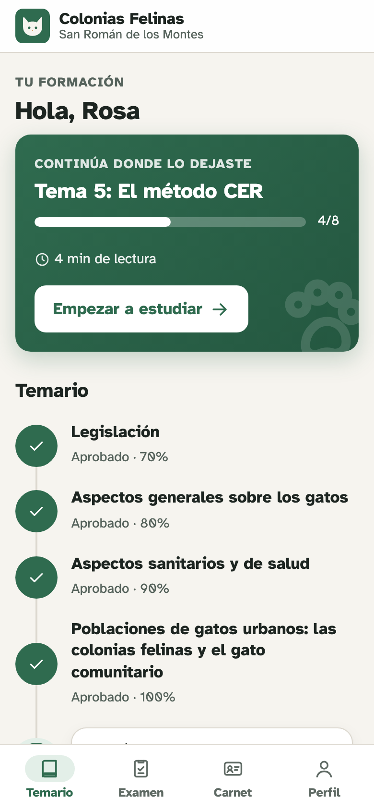
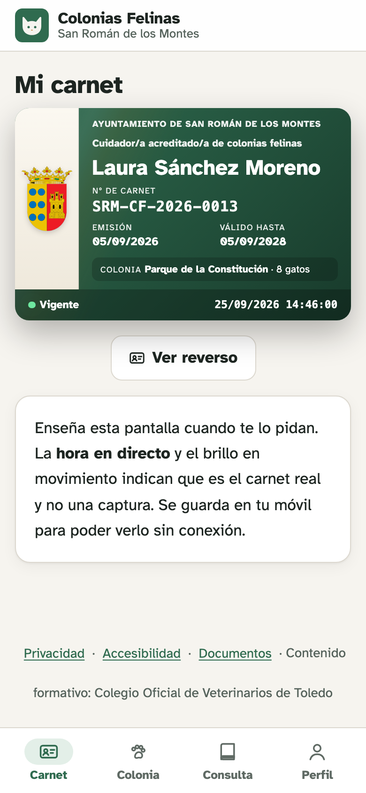
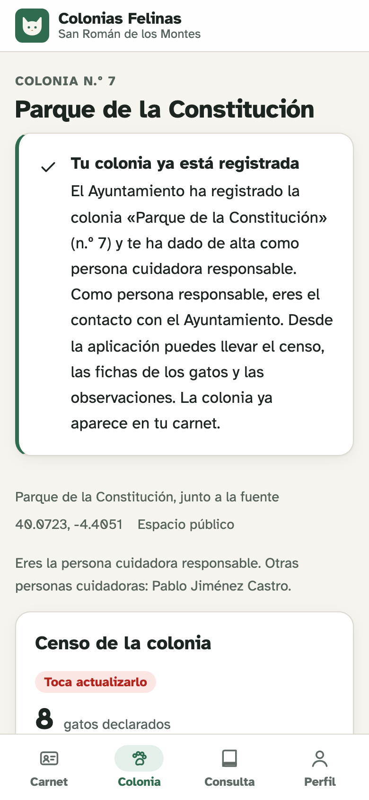
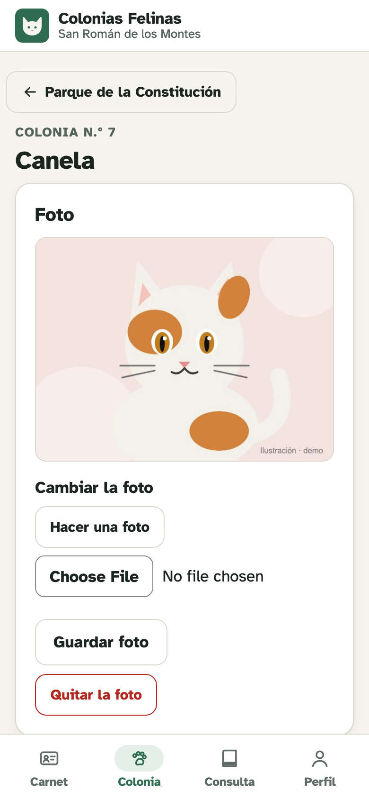

<div align="center">


# Cuidadores de Colonias Felinas

**La aplicación para que tu ayuntamiento forme, acredite y coordine a las personas que cuidan colonias felinas.**

Curso con tests · examen con corrección por IA · carnet digital · registro y seguimiento de colonias · avisos en el móvil

[](LICENSE)
[](https://workers.cloudflare.com)
[](https://astro.build)
[-5a0fc8)](#-qué-hace)
[](docs/TECNICO.md)

&nbsp;
&nbsp;
&nbsp;


</div>

---

## 🐾 Por qué existe

La Ley 7/2023 de bienestar animal pide a los ayuntamientos gestionar las colonias felinas con el método CER
(captura, esterilización y retorno), y muchas ordenanzas municipales exigen que las personas que las cuidan estén
**formadas y acreditadas**. En la práctica, eso significa cursos, exámenes, carnés, registros de colonias, censos cada
seis meses… normalmente en papel.

Esta aplicación lo pone todo en el móvil. Se ha desarrollado para el **Ayuntamiento de San Román de los Montes
(Toledo)** y se comparte como software libre para que **cualquier otro ayuntamiento** la pueda usar o adaptar.

## ✨ Qué hace

**Para las personas cuidadoras**

- 📚 **Curso por temas** con un test al final de cada uno: aprobar un tema desbloquea el siguiente.
- 📝 **Examen final** con preguntas tipo test y respuestas escritas que **corrige una IA (JEV)** al momento.
- 🪪 **Carnet digital** con la hora en directo (para que no valga una captura), que funciona **sin cobertura**.
- 🏡 **Mi colonia**: censo semestral, ficha de cada gato con foto, intervenciones veterinarias y observaciones.
- 📄 **Solicitudes en PDF** rellenadas desde el móvil (registro de colonia, alta como colaborador/a, autorización de la
  persona propietaria), listas para firmar o presentar en la sede electrónica.
- 🔔 **Avisos en el móvil y por correo**: alta de la colonia, censo pendiente, carnet a punto de caducar.
- 📲 **Se instala como una app** (Android e iPhone) sin pasar por ninguna tienda.

**Para el ayuntamiento**

- 🗂️ **Panel de administración**: temas, banco de preguntas (importar y exportar en CSV o JSON), ajustes del curso,
  personas y su progreso, cada examen con la corrección de la IA, carnés (revocar o renovar) y colonias.
- 🐈 **Registro de colonias** con sus cuidadores. Quien deja de colaborar explica el motivo y la IA comprueba que es
  concreto y, si era la única persona a cargo, que indica quién la releva o que ya no quedan gatos.
- 🏛️ **Tu municipio, tu escudo, tu ordenanza**: todo se configura desde el panel, sin tocar código.
- ♿ **Accesible** (WCAG 2.1 AA, comprobado con tests automáticos) y con declaración de accesibilidad.
- 🔒 **Sin contraseñas** (enlace de acceso por correo), fotos privadas y datos alojados en tu propia cuenta de Cloudflare.

## 👀 Pruébala

Hay una **demo** en [demo.colonia.dev](https://demo.colonia.dev) con datos ficticios: se entra eligiendo un perfil
(«empieza el curso», «responsable de una colonia», «personal del ayuntamiento»…) y tiene atajos para recorrerlo todo
en unos minutos. El acceso es con un enlace privado: pídelo abriendo un
[issue](https://github.com/noelserdna/colonias-felinas/issues).

## 💶 Cuánto cuesta

Unos **5 $ al mes** (unos 4,5 €) para casi cualquier municipio:

| Servicio | Para qué | Coste |
|---|---|---|
| **Cloudflare Workers Paid** | Alojar la web, la base de datos, las fotos y enviar los correos | **5 $/mes**. Incluye 10 millones de peticiones al mes, la base de datos, **3.000 correos al mes** (Cloudflare Email) y 10 GB de fotos. A partir de ahí, céntimos: 0,35 $ por cada 1.000 correos y 0,015 $ por GB de fotos al mes |
| **Dominio** | La dirección de la web y del correo | **0 €** con un subdominio del ayuntamiento (p. ej. `colonias.ayto-ejemplo.es`); si no, unos **10 €/año** |
| **TypeSafe – JEV** (opcional) | Corregir con IA las respuestas escritas y las bajas | **Unos pocos euros** de saldo: cada corrección es una llamada pequeña |

> **¿Y el plan gratuito de Cloudflare?** Sirve para **probarla**, pero no para el uso diario: limita cada petición a
> 10 ms de CPU y las páginas de la aplicación usan entre 10 y 30 ms (medido en la demo), así que Cloudflare cortaría
> muchas (error 1102). Si aun así quieres empezar gratis, el correo tiene que ir por **Resend** (gratis hasta 3.000
> correos al mes y 100 al día), que se configura en el panel.
>
> Sin JEV la aplicación funciona igual, pero el examen final es solo de tipo test.

## 🏘️ ¿Para qué municipios es adecuada?

En España hay unos **1,8 millones de gatos comunitarios en unas 125.000 colonias**
([Plan de Acción 2026-2030](https://www.animalshealth.es/politica/asi-es-plan-accion-sobre-gestion-colonias-felinas-espana-one-health-veterinarios-elemento-imprescindible)):
de media, **una colonia por cada 400 habitantes** y unos 14 gatos por colonia, con más densidad en los municipios
rurales que en las grandes ciudades (Barcelona tiene entre
[614 y 700 colonias](https://ajuntament.barcelona.cat/benestaranimal/es/gatos) para 1,66 millones de habitantes: una
por cada 2.500). Según el [estudio de las Jornadas Felinas Nacionales](https://jornadasfelinasnacionales.com/wp-content/uploads/2022/09/Situacio%CC%81n-colonias-felinas-Espan%CC%83a_JFN2021.pdf),
el 40 % de las personas cuidadoras trabaja sola y la mayoría atiende una o dos colonias.

Con esas cifras, y las 1–2 personas cuidadoras por colonia de esa encuesta, esto es lo que necesitaría cada municipio:

| Habitantes | Colonias (estimación) | Personas cuidadoras | Correos al mes | Fotos al año | Coste | ¿Adecuada? |
|---|---|---|---|---|---|---|
| Menos de 5.000 | 2 – 12 | hasta 25 | menos de 30 | < 0,3 GB | 5 $/mes | ✅ Ideal |
| 5.000 – 20.000 | 8 – 50 | 10 – 100 | hasta 100 | < 1 GB | 5 $/mes | ✅ Ideal |
| 20.000 – 100.000 | 40 – 250 | 60 – 500 | 100 – 500 | 1 – 5 GB | 5 $/mes | ✅ Muy adecuada |
| 100.000 – 300.000 | 120 – 750 | 200 – 1.500 | 300 – 1.500 | 3 – 15 GB | 5 – 6 $/mes | 🟡 Funciona; conviene añadir paginación y filtros al panel |
| Más de 300.000 | cientos o miles | miles | más de 1.500 | 15 GB o más | 6 – 10 $/mes | 🟠 Técnicamente escala, pero necesitaría adaptaciones (distritos, varios equipos, mapa) |

- **Correos**: cada sesión dura 90 días, así que cada persona recibe pocos enlaces de acceso; lo demás son avisos
  (alta de la colonia, censo cada seis meses, caducidad del carnet). Hasta 3.000 al mes están incluidos.
- **Fotos**: la app las reduce en el móvil (unos 0,3 MB cada una); con unas 4 fotos por gato al año, son unos
  20 MB por colonia y año. Los primeros 10 GB son gratis.
- **Peticiones**: incluso el municipio más grande queda muy lejos de los 10 millones al mes incluidos.

**En resumen**: es ideal para municipios de **hasta unos 100.000 habitantes**, que son el **99 % de los 8.132
municipios de España** (solo 68 superan esa cifra, [INE 2025](https://www.ine.es/dyngs/Prensa/CensoVariables2025.htm)),
por unos 5 $ al mes. Por encima funciona, pero el panel de administración está pensado para decenas o cientos de
colonias, no para miles.

## 🚀 Instálala para tu municipio

### Opción recomendada: con ayuda de una IA

No hace falta saber programar. Un **asistente de IA que pueda ejecutar comandos en tu ordenador** (por ejemplo
[Claude Code](https://claude.com/claude-code)) puede hacer casi toda la instalación por ti: este repositorio incluye
[instrucciones específicas para él](AGENTS.md).

1. Crea una cuenta en **[Cloudflare](https://dash.cloudflare.com/sign-up)** y contrata el plan **Workers Paid**
   (5 $/mes: *Workers & Pages → Plans*).
2. *(Opcional)* Crea una cuenta en **[TypeSafe](https://console.typesafe.ai)**, añade unos pocos euros de saldo y
   genera una clave en *API keys*.
3. Instala **[Node.js](https://nodejs.org)** (versión LTS) y tu asistente de IA.
4. Abre el asistente en una carpeta vacía y pégale esto, cambiando lo que va entre corchetes:

```text
Quiero instalar la aplicación «Cuidadores de Colonias Felinas»
(https://github.com/noelserdna/colonias-felinas) para el Ayuntamiento de [MUNICIPIO] ([PROVINCIA]).
Clona el repositorio y sigue su archivo AGENTS.md paso a paso. Explícame cada paso de forma sencilla,
pregúntame lo que necesites y avísame antes de hacer nada que cueste dinero.
Mi correo de administración es [CORREO]. [Tengo / No tengo] dominio para enviar correos.
```

El asistente te pedirá que inicies sesión en Cloudflare desde el navegador y te irá guiando. Al terminar tendrás la
aplicación funcionando en una dirección `https://….workers.dev`.

### Opción manual: paso a paso

<details>
<summary><strong>Ver los 10 pasos</strong> (unos 30–45 minutos; hay que usar la terminal)</summary>

1. **Cuentas**: crea una cuenta en [Cloudflare](https://dash.cloudflare.com/sign-up) y contrata **Workers Paid**
   (5 $/mes, *Workers & Pages → Plans*). Si quieres corrección con IA, crea otra en
   [TypeSafe](https://console.typesafe.ai), añade unos pocos euros y crea una clave.
2. **Herramientas**: instala [Node.js](https://nodejs.org) (LTS, 22 o superior) y [Git](https://git-scm.com).
3. **Descarga la aplicación**:
   ```bash
   git clone https://github.com/noelserdna/colonias-felinas.git
   cd colonias-felinas
   npm install
   ```
4. **Conecta con Cloudflare** (se abre el navegador para autorizar):
   ```bash
   npx wrangler login
   ```
5. **Crea la base de datos y el almacén de fotos**:
   ```bash
   npx wrangler d1 create colonias          # anota el "database_id"
   npx wrangler r2 bucket create colonias-fotos
   ```
   Si R2 no está activado, actívalo en el panel de Cloudflare (*R2 Object Storage*). Puede pedirte una tarjeta aunque
   no se cobre nada dentro del nivel gratuito.
6. **Configura `wrangler.jsonc`** (con cualquier editor de texto):
   - `name`: `colonias-felinas-tu-municipio`; `database_id`: el del paso 5.
   - Borra los bloques `routes` y `env` (son de la instalación de San Román).
   - `APP_NAME` y `MAIL_FROM` con el nombre de tu municipio y tu dirección de envío.
7. **Correo** — elige una opción:
   - **Cloudflare Email** (incluido en Workers Paid): con el dominio en Cloudflare, ejecuta
     `npx wrangler email sending enable tu-dominio.es`.
   - **Resend** (gratis hasta 3.000 correos al mes): útil si el dominio no está en Cloudflare. En
     [resend.com](https://resend.com), *Domains → Add domain*, añade en tu DNS los registros que te indica y crea una
     clave en *API Keys*. La clave y el remitente se ponen después en el panel (*Ajustes → Correo*), con un botón para
     enviarte un correo de prueba.
8. **Claves y secretos**:
   ```bash
   node scripts/vapid-keys.mjs              # "publicKey" → VAPID_PUBLIC_KEY en wrangler.jsonc
   npx wrangler secret put VAPID_PRIVATE_KEY   # pega el "privateJwk" (en una línea)
   npx wrangler secret put APP_SECRET          # una frase aleatoria larga
   npx wrangler secret put ADMIN_EMAILS        # tu correo
   ```
9. **Contenido y publicación**. Edita antes `seed/documents.json` (trae los documentos de San Román) y después:
   ```bash
   npm run db:migrate:remote
   npm run db:seed:remote
   npm run deploy            # te da la dirección https://….workers.dev
   ```
   Pon esa dirección en `APP_ORIGIN` (en `wrangler.jsonc`) y vuelve a ejecutar `npm run deploy`.
10. **Entra** con tu correo. Si el correo aún no está configurado, el enlace de acceso aparece en la terminal con
    `npx wrangler tail` al pedirlo. Después completa *Administración → Ajustes* (paso siguiente).

</details>

### Después de instalar: adáptala a tu municipio (desde el panel)

1. **Ajustes**: municipio, provincia, **escudo**, contacto de accesibilidad, **correo** (clave de Resend, remitente y
   correo de prueba) y la **clave de JEV**. Las claves se guardan cifradas.
2. **Temas**: se crean 8 temas con un texto de ejemplo. Redacta el vuestro o pega el temario que tengáis.
3. **Preguntas**: impórtalas en CSV o JSON (*Preguntas → Importar*). Tu asistente de IA puede generarlas a partir de
   vuestro temario en el formato de [`docs/preguntas-ejemplo.json`](docs/preguntas-ejemplo.json). **Que las revise
   una persona experta** antes de abrir la plataforma.
4. **Guía «Mi colonia»** y **Documentos**: cámbialos para que sigan **vuestra ordenanza** (la guía por defecto sigue
   la de San Román).
5. Comparte la dirección con las personas cuidadoras. ¡Listo!

> **Sobre el temario**: el de San Román procede del *Manual de buenas prácticas en la gestión de colonias felinas* del
> Colegio Oficial de Veterinarios de Toledo y **no se incluye** en este repositorio. Cada municipio debe aportar su
> propio temario o pedir permiso a quien tenga los derechos (por ejemplo, al colegio de veterinarios de su provincia).
> Si usáis el de un colegio, indicadlo en *Ajustes → Autoría del contenido formativo*.

## 🛠️ Para desarrolladores

**Stack**: [Astro 7](https://astro.build) (SSR) sobre **Cloudflare Workers** · **D1** (SQLite) con Drizzle ORM ·
**R2** para las fotos · islas **React** · **JEV** de [TypeSafe](https://typesafe.ai) para la corrección ·
**Cloudflare Email Service** o Resend · **Web Push** propio con WebCrypto (RFC 8291 + VAPID, sin dependencias) ·
**pdf-lib** en el navegador · PWA con service worker propio.

```bash
cp .dev.vars.example .dev.vars
npm install
npm run db:migrate:local && npm run db:seed:local
npm run dev                 # http://localhost:4321 · el enlace de acceso aparece en la página (MAIL_MOCK=1)
npm test                    # unitarios (vitest)
npx playwright test         # E2E + accesibilidad con axe-core
```

Arquitectura, variables, crons, notificaciones push, instancia demo y las piezas ligadas a la ordenanza de
San Román: **[docs/TECNICO.md](docs/TECNICO.md)**. Instrucciones para asistentes de IA: **[AGENTS.md](AGENTS.md)**.

¿Mejoras, errores o dudas? Abre un [issue](https://github.com/noelserdna/colonias-felinas/issues) o un pull request.

## 📜 Licencia

El código se publica con la **[Licencia Pública de la Unión Europea (EUPL) v1.2](LICENSE)**, la licencia de software
libre de la Comisión Europea pensada para administraciones públicas: cualquier ayuntamiento u organización puede usar,
estudiar, modificar y redistribuir la aplicación, siempre que comparta con la misma licencia las mejoras que
distribuya o ofrezca como servicio. Es compatible con otras licencias libres (GPL, AGPL, MPL…) y tiene
[versión oficial en español](https://joinup.ec.europa.eu/collection/eupl/eupl-text-eupl-12).

La licencia cubre el código, no el contenido formativo, ni el escudo ni la identidad del Ayuntamiento de San Román
de los Montes.
